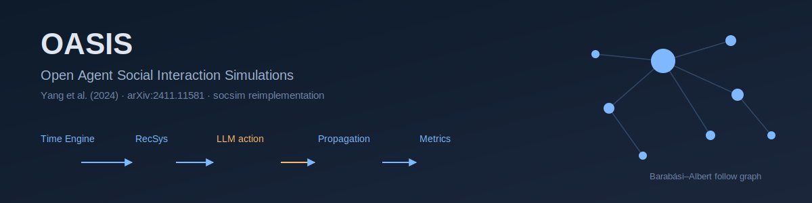

<p align="center"></p>

[English](README.md) | **日本語**

# OASIS: Open Agent Social Interaction Simulations with One Million Agents — Yang et al. (2024)

Yang et al. (2024)「OASIS: Open Agent Social Interaction Simulations with One Million Agents」(arXiv:2411.11581) の再現実装．エージェント集団は**動的なソーシャルメディアのフォローグラフ** (Barabási–Albert スケールフリーネットワーク) 上のノードである．各タイムステップで **Time Engine** が一部のエージェントを活性化し (24 次元の時間活動確率 × 活性化率)，決定論的な**推薦器**が各 active エージェントのフィードを構築し (X は興味マッチのコサイン類似度，Reddit はホットスコア)，エージェントは 1 つのアクション (post / repost / like / follow / none) を選ぶ．影響力のある**オピニオンリーダー** (高次数ノード) は CoT で LLM を呼び，残りの集団は確率的な簡易ポリシーで近似する．選択されたアクションは投稿ストアとソーシャルグラフを更新し，情報がネットワーク上を**カスケード**し，**グループ極化**が創発する．決定論的な [socsim](https://github.com/akitenkrad/rs-social-simulation-tools) コアが BA ネットワーク・活性化・推薦・情報伝播・指標を担い，非決定的な LLM レイヤは 1 つのメカニズムに閉じ込め，`socsim-llm` クレートで擬似決定論化する (プロンプト→応答キャッシュ + `temperature=0` + 固定 seed)．

## 二層決定論 (最初に読む)

LLM の出力は socsim の bit 再現性の **外側** にある．したがって設計は二層に分かれる:

- **決定論的 socsim コア** — BA 網生成・Time-Engine 活性化・推薦器 (興味マッチ / ホットスコア / アブレーション)・動的フォローグラフ上の情報伝播・指標．seed を与えれば bit 単位で再現する．
- **非決定的 LLM レイヤ** — オピニオンリーダーの CoT 行動選択．`socsim-llm` の `CachingClient` (`hash(prompt+model)` → 応答キャッシュ)・`temperature=0`・固定 seed で擬似決定論化する．プロバイダ順は `socsim-llm` の `FallbackClient` により **Ollama 第一 → OpenAI フォールバック**．

再現性を担うのはモデルではなく**キャッシュ**である: ウォームキャッシュは同一応答を再生するため，再実行はコスト 0 で安定する．各実行は `llm_meta.json` にプロバイダ・モデル・endpoint・温度・seed・cache-hit 率を記録する．ローカル既定モデル (`llama3.2:latest`) は論文の GPT 系と異なるため，再現目標は**定性的** (カスケードの伸び・極化の増大・スケール効果の傾向と符号) であり，論文の数値完全一致は狙わない．

## スケーラビリティ設計

OASIS の核心的貢献は 100 万エージェントへのスケーリングである．決定論的コアは線形にスケールし，LLM 呼び出しを incur するのは **active かつ詳細化された**エージェントのみである．本実装はこれを次で踏襲する: 活性化サブサンプリング (`--activation-rate`)，二層エージェント詳細度 (`--n-leaders` の高次数ノードのみ LLM を呼び，残りは意見がピアへドリフトする簡易ポリシー)，必須のプロンプトキャッシュ，超過時に簡易ポリシーへフォールバックする `--llm-budget` 上限．小規模既定 (`--n-agents 200`) は扱いやすく，`--n-agents 5000` で拡張する．

## インストールとクイックスタート

```bash
# Rust シミュレーションをビルド (socsim と socsim-llm の Ollama+OpenAI バックエンドを取得)
cargo build --release

# ローカル Ollama を起動しモデルを pull しておく:
#   ollama pull llama3.2:latest
export OLLAMA_HOST=http://localhost:11434
export OLLAMA_MODEL=llama3.2:latest
# OpenAI フォールバック (任意):
#   export OPENAI_API_KEY=sk-...   OPENAI_MODEL=gpt-4o-mini

# 小規模実行 (X 興味推薦, 200 エージェント, 20 リーダー, 30 ステップ)
cargo run --release -- run --platform x --n-agents 200 --n-leaders 20 --timesteps 30 --seed 42

# Python 可視化ツールを導入 (workspace ルートで)
uv sync

# 直近実行を可視化 (極化推移・active-user 数・伝播・カスケード木)
uv run oasis-tools visualize

# 実行設定と LLM メタデータの確認
uv run oasis-tools show-experiment-settings --results-dir results/latest
```

### オフラインスモーク (ライブ LLM 不要)

```bash
# mock LLM クライアントでパイプライン全体を実行 (ネットワーク不要)
cargo run --release --example mock_smoke -- results
uv run oasis-tools visualize

# あるいはリーダー数 0 で実 CLI を実行 (周辺エージェントの簡易ポリシーのみ; LLM 非呼び出し)
cargo run --release -- run --n-leaders 0 --n-agents 40 --timesteps 10 --seed 42
```

## ドキュメント

- [ユースケース](docs/usecases.ja.md) — 本プロジェクトでできること，および他ドキュメントへの案内．
- [CLI](docs/cli.ja.md) — Rust CLI: `run` / `sweep` サブコマンドとフラグ，LLM 環境変数．
- [可視化](docs/visualization.ja.md) — Python `oasis-tools` と出力の読み方．
- [アーキテクチャ](docs/architecture.ja.md) — リポジトリ構成・動的フォローグラフ・二層決定論・socsim/`socsim-llm` 基盤・6 メカニズム・指標・参考文献．

## 対応範囲

本リポジトリは現状 **Phase 1** (コア動的ネットワークモデル: Time-Engine 活性化・決定論的推薦器・LLM を閉じ込めたリーダー行動メカニズム (Ollama→OpenAI フォールバック + キャッシュ)・情報伝播メカニズム・`run` サブコマンド・指標) と **Phase 2** (エージェント数 × 活性化率の `sweep`，Python `visualize` / `visualize-sweep` / `show-experiment-settings` ツール) を実装している．論文 Finding の一括再現 (`reproduce`: 情報拡散 / 極化 / 群衆効果 / RecSys アブレーション) と数千規模へのスケーリングは Phase 3 の課題として残置し，随所に拡張点を設けている．

## ライセンス

MIT

---
*This file was generated by Claude Code.*
