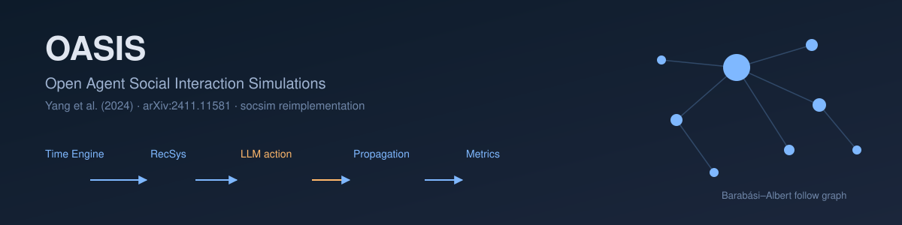

<p align="center"></p>

**English** | [日本語](README.ja.md)

# OASIS: Open Agent Social Interaction Simulations with One Million Agents — Yang et al. (2024)

A reimplementation of the OASIS model of Yang et al. (2024), "OASIS: Open Agent Social Interaction Simulations with One Million Agents" (arXiv:2411.11581). A population of agents sits on a **dynamic social-media follow graph** (a Barabási–Albert scale-free network). On each timestep the **Time Engine** activates a subset of agents (24-dimensional hourly activity probabilities × an activation rate), a deterministic **recommender** builds each active agent's feed (X interest-match cosine similarity, or Reddit hot-score), and agents choose one action (post / repost / like / follow / none). Influential **opinion leaders** (top-degree nodes) call an LLM with chain-of-thought; the rest of the population uses a cheap stochastic policy. Selected actions update the post store and the social graph, so information **cascades** through the network and **group polarization** emerges. The deterministic [socsim](https://github.com/akitenkrad/rs-social-simulation-tools) core handles the BA network, activation, recommender, info propagation and metrics; the non-deterministic LLM layer is confined to a single mechanism and pseudo-determinised via the `socsim-llm` crate (prompt→response cache + `temperature=0` + fixed seed).

## Two-layer determinism (read this first)

LLM output is **outside** socsim's bit-reproducibility. The design therefore splits into two layers:

- **Deterministic socsim core** — BA network generation, Time-Engine activation, the recommender (interest-match / hot-score / ablation), info propagation along the dynamic follow graph, and metrics. Given a seed this reproduces bit-for-bit.
- **Non-deterministic LLM layer** — the opinion leaders' chain-of-thought action choice. Pseudo-determinised by `socsim-llm`'s `CachingClient` (a `hash(prompt+model)` → response cache), `temperature=0` and a fixed seed. The provider order is **Ollama first → OpenAI fallback** via `socsim-llm`'s `FallbackClient`.

The cache — not the model — is the reproducibility mechanism: a warm cache replays identical responses, so a rerun is free and stable. Each run records the provider, model and temperature in the `llm` block of runvault's `run.json`, and the call count and cache-hit rate as run-scope metrics in `metrics.csv`. Because the local default model (`llama3.2:latest`) differs from the paper's GPT models, reproduction targets are **qualitative** (the trend and sign of the curves: cascade growth, rising polarization, scale effects), not the paper's exact numbers.

## Scalability design

OASIS's core contribution is scaling toward one million agents. The deterministic core scales linearly; only **active, detailed** agents incur an LLM call. This implementation mirrors that with: activation subsampling (`--activation-rate`), a two-tier agent fidelity (only `--n-leaders` top-degree nodes call the LLM; the rest use a cheap policy whose opinions drift toward peers), a mandatory prompt cache, and an `--llm-budget` cap that falls back to the cheap policy when exhausted. The small default (`--n-agents 200`) is easy to run; scale up with `--n-agents 5000`.

## Install & Quick start

```bash
# Build the Rust simulation (fetches socsim incl. socsim-llm with the Ollama+OpenAI backends)
cargo build --release

# Make sure a local Ollama is running and a model is pulled, e.g.:
#   ollama pull llama3.2:latest
export OLLAMA_HOST=http://localhost:11434
export OLLAMA_MODEL=llama3.2:latest
# Optional OpenAI fallback:
#   export OPENAI_API_KEY=sk-...   OPENAI_MODEL=gpt-4o-mini

# Run a small simulation (X interest recommender, 200 agents, 20 leaders, 30 steps)
cargo run --release -- run --platform x --n-agents 200 --n-leaders 20 --timesteps 30 --seed 42

# Install the Python visualization tools (at the workspace root)
uv sync

# Visualize the most recent run (polarization / active-user / propagation / cascade tree)
uv run oasis-tools visualize

# Inspect the run's settings and LLM metadata
uv run oasis-tools show-experiment-settings
```

### Offline smoke (no live LLM)

```bash
# Exercise the full pipeline with a mock LLM client (no network egress)
cargo run --release --example mock_smoke -- results
uv run oasis-tools visualize

# Or run the real CLI with no leaders (peripheral cheap policy only — no LLM calls)
cargo run --release -- run --n-leaders 0 --n-agents 40 --timesteps 10 --seed 42
```

## Documentation

- [Use cases](docs/usecases.md) — what you can do with this project, with pointers to the rest of the docs.
- [CLI](docs/cli.md) — the Rust CLI: the `run`, `sweep`, and `reproduce` subcommands and their flags, plus the LLM environment variables.
- [Visualization](docs/visualization.md) — the Python `oasis-tools` and how to interpret the outputs.
- [Architecture](docs/architecture.md) — repository structure, the dynamic follow-graph, the two-layer determinism, the socsim/`socsim-llm` framework, the six mechanisms, the metrics, and references.

## Scope

The repository provides:

- **`run`** — the core dynamic-network model: Time-Engine activation, the deterministic recommender (interest-match / hot-score / ablation), the LLM-confined leader action mechanism (Ollama→OpenAI fallback + prompt caching), info propagation along the follow graph, and the metrics.
- **`sweep`** — a sensitivity scan over agent count × activation rate.
- **`reproduce`** — a one-shot reproduction of OASIS's headline emergent phenomena (information-diffusion cascades, group polarization, and crowd / herd effects) contrasted across a RecSys ablation (interest / hot-score / none), with a `--mock` deterministic scripted client so it runs fully offline and bit-deterministically. It scores the observed metrics against the paper's qualitative findings, leaving the verdicts in the run's `events.jsonl` and the per-condition metrics in `metrics.csv`, and draws the figures.
- **Python `oasis-tools`** — `visualize`, `visualize-sweep`, `show-experiment-settings`, and `reproduce` (report + figures).

The paper's million-agent scale is not run here: the implementation documents the scaling path (activation subsampling, two-tier detail with leaders-only LLM, prompt caching, `--llm-budget`) and defaults to a small `N`. Faithfulness is qualitative — local llama3.2 is not the paper's GPT-3.5/4, so the goal is the *trend* (multi-hop cascades, emergent polarization, recommender-shaped diffusion), not exact values.

## License

MIT

---
*This file was generated by Claude Code.*
